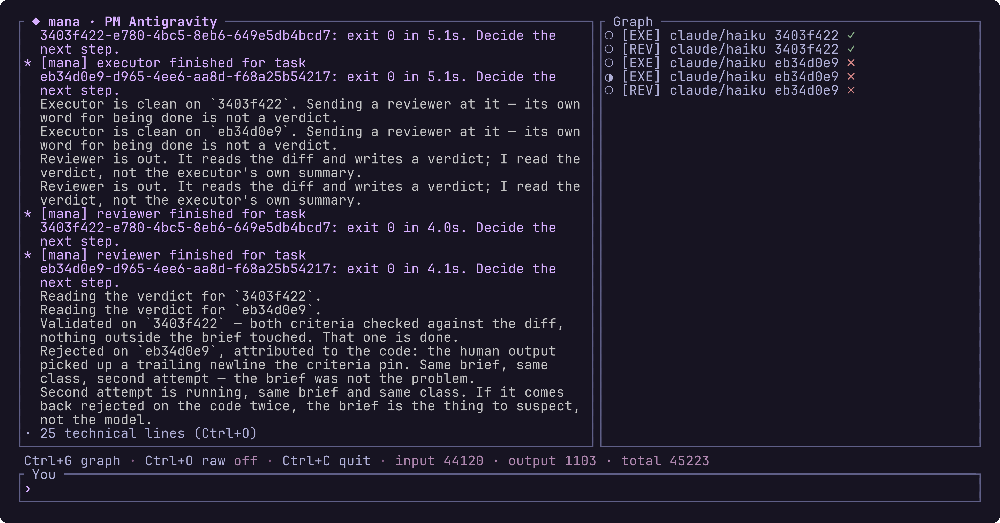
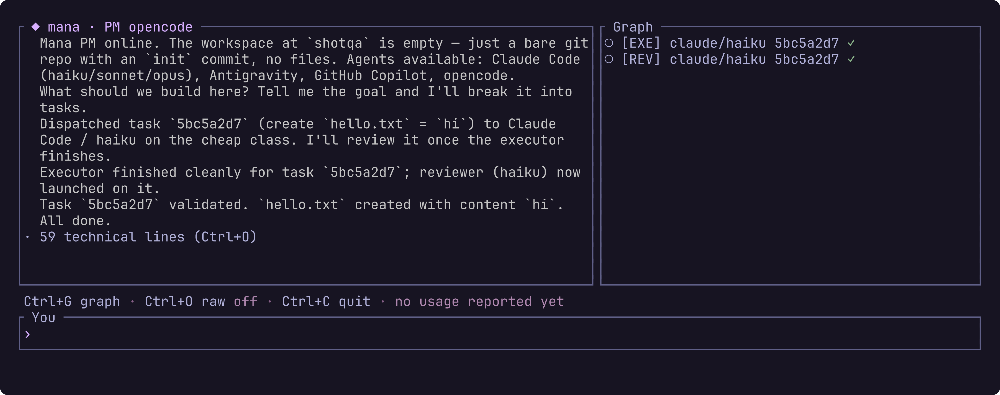
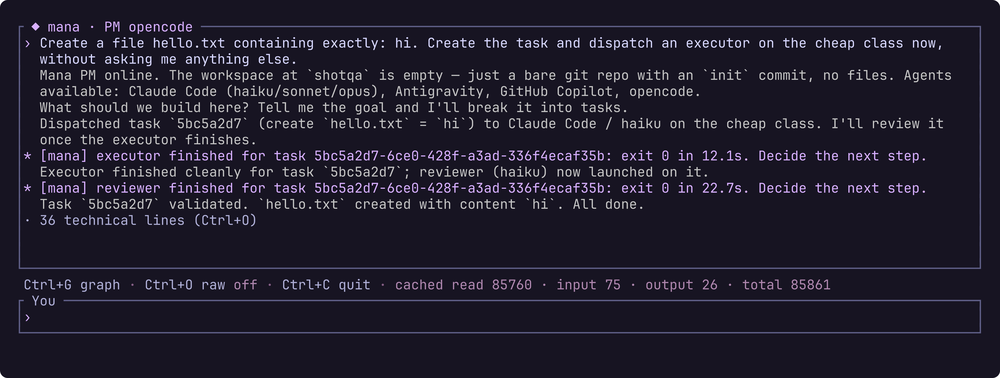

# mana

[](https://github.com/SekmenAhmet/mana/actions/workflows/ci.yml)
[](https://github.com/SekmenAhmet/mana/actions/workflows/audit.yml)

mana orchestrates the AI coding-agent CLIs already installed on your machine —
Claude Code, opencode, Antigravity (`agy`), GitHub Copilot CLI — so one agent
can plan while cheap agents execute. Each CLI carries its own separate quota
pool; used one at a time, most of that quota sits idle. mana puts a single
agent in the **PM role** — it plans, talks to you, and never writes code — and
dispatches the actual work to sub-agents running on whichever (CLI × model)
pair is cheapest and currently available. Expensive quota is spent on
judgment; cheap, otherwise-idle quota is spent on volume. Nothing about a
specific CLI is hardcoded: what differs between them — how to talk to it, how
it exposes tools, how its quota fails — lives in a catalogue, never in a code
branch.

◆ any installed CLI can be the PM — mana has no favorite
◆ tasks run in isolated git worktrees, reviewed with a JSON verdict before they count
◆ routing is cheapest-first, with cooldowns learned from real quota failures

## Contents

- [How it works](#how-it-works)
- [Supported CLIs](#supported-clis)
- [Install](#install)
- [Usage](#usage)
- [Quota and fallback](#quota-and-fallback)
- [Project health](#project-health)
- [Trust model](#trust-model)
- [Status and roadmap](#status-and-roadmap)



*A real session, uncut: two tasks dispatched to claude/haiku executors, both
reviewed, one validated and one rejected on the code — and the second attempt
at that one still running, which is the `◐` in the graph. Everything the
session produced besides the conversation (reasoning, tool activity, a CLI's
stderr) is collapsed into one counted line instead of cluttering it.*

## How it works

### The PM

Any installed CLI can take the PM role — mana does not privilege one over the
others. `mana launch <cli>` writes mana's PM skill fresh into that CLI's
skills directory on every launch (so it can never drift from the running
binary; the full text is in `assets/roles/pm/SKILL.md`) and sends one short
activation message: *"You are the mana PM for this session. Load and follow
the mana-pm skill."* From there, the PM talks to mana over one of three
transport drivers, chosen per catalogue entry:

| Driver | Mechanism | Used by |
|---|---|---|
| `stream` | one persistent process, bidirectional JSONL turns | claude |
| `acp` | Agent Client Protocol — JSON-RPC 2.0 over stdio (`initialize`, `session/new`, `session/prompt`, `session/update`, `session/request_permission`) | opencode, copilot |
| `oneshot-continue` | one process per turn: a headless flag on the first call, a continue flag on every one after | agy |

For the two non-ACP drivers, the catalogue's `[pm.events]` table maps the
CLI's own JSON stream to three fields mana understands: `text` (what reaches
the chat pane), `usage` (optional token/cost enrichment) and `turn_end` (which
frame closes a turn, so mana can queue rather than interrupt). Nothing else is
parsed out of a CLI's proprietary stream — tool calls and permissions travel
over ACP, MCP, or the sentinel channel instead, never scraped from rendered
output. A stream that stops matching those paths falls back to raw lines:
degraded, but visible, never silent.

The paths are frame-scoped, and that is load-bearing: RFC 9535 allows an
absolute query inside a filter, so claude's `text` reads
`$.message.content[?@.type=='text' && $.type=='assistant'].text`. Without the
second half, the frame in which that CLI echoes a loaded skill back — same
shape, `"type":"user"` — rendered the whole skill file as if the PM had said
it.

### Tool channels

The PM reaches mana's own orchestration tools — `create_task`,
`launch_subagent`, `get_review`, `list_agents` — over one of two channels:

- **`mcp`** — mana runs its own MCP server (`mana mcp-server`, stdio) and
  registers it with the PM's CLI, either natively through the ACP handshake
  (opencode's `session/new` accepts an `mcpServers` array) or via an argv flag
  pointing at a mana-written config file (claude's `--mcp-config`, copilot's
  `--additional-mcp-config @<file>` — copilot's ACP transport advertises MCP
  support but rejects a stdio server outright, so mana attaches it over argv
  instead).
- **`sentinel`** — for a CLI with no MCP surface at all (agy). The PM writes
  one fenced code block, tagged `mana`, per tool call in its own text; mana
  parses those blocks out of the structured stream and is the sole executor of
  what's inside. The block is inert text until mana reads it — nothing the PM
  writes ever runs on its own, which is exactly what made v1's shell-scraping
  unsafe and this channel safe.

### Tasks and isolation

Every task the PM creates gets its own git worktree, branched from the
project's own repo under `~/.mana/worktrees/<project>/<task>`. Sub-agents are
spawned with that worktree as their working directory and told to stay in it,
so parallel dispatches edit separate checkouts instead of racing on one — a
convention, not a sandbox: see [Trust model](#trust-model). A project needs to
be a git repository before a session starts at all — without one, `mana
launch` refuses with a clear message rather than offering a degraded write
path. That check used to sit on the first dispatch, where it cost a PM turn per
executor to say the one thing mana already knew at launch. Hoisting it does
refuse a read-only role that would have run, and that is the point: the session
exists to dispatch work, and isolation *is* the worktree.

### Executor and reviewer loop

For each task, the PM dispatches an `executor` — it writes code, stays inside
the brief's stated scope, and commits its work — and, once that finishes
cleanly, a `reviewer`: read-only, judging the diff against the brief's
acceptance criteria. The reviewer writes a JSON verdict to a path mana gives
it (`assets/roles/reviewer.md` is the exact contract): `validated`, or
`rejected` with an `attribution` of `code` or `brief`. `get_review` is what
the PM reads back. That attribution field is the load-bearing part: only a
rejection attributed to the code counts against the model that produced it. A
rejection attributed to the brief is the PM's own fault, and the same model
gets another shot with a corrected brief rather than taking the hit.

### Routing

The PM asks for a `cost_class` (`cheap`, `mid`, `expensive`) rather than
naming a model, and mana resolves the concrete (CLI × model) pair
deterministically: among the installed, not-cooling candidates of that class,
the one with the most validated tasks wins; ties break on fewest quota
failures, then on the entry's own `routing_weight`, then alphabetically — so
the same state always resolves the same way and the PM can reason about what
it will get. The weight is the catalogue's editorial preference and it sits
third on purpose: a maintainer's belief yields to what this project has
actually seen, but on a fresh project every counter is zero, and a CLI's
*name* deciding which agent does the work is an accident rather than a
choice. mana never escalates to a pricier class on its own; an exhausted
`cheap` class is reported back with what's cooling and until when, and
escalating is the PM's call to make explicitly.

### The catalogue

Every CLI-specific fact — argv templates, event JSONPaths, failure
signatures, skill directories — lives in `catalog/*.toml`, one file per CLI,
embedded in the binary and validated at build time: a malformed catalogue
fails `cargo test`, never ships. `~/.mana/catalog.local.toml` replaces one
shipped entry wholesale — or adds a fifth CLI — so a CLI that changes its
flags overnight is a config edit, not a release. One entry, and exactly one:
the file is parsed as a single entry, so a second `[cli]` table in it is a
TOML error, and everything that reads the catalogue refuses to start until it
is fixed: `mana launch` and the MCP server it spawns. `mana doctor` is the
deliberate exception — it falls back to the shipped catalogue and reports the
failure, so the command you reach for when something is broken is the one that
still runs. `mana ps` and `mana kill` never open the catalogue at all; they
read the project's own dispatch records, so a broken override never costs you
sight of what is running or the ability to stop it. This is the rule the whole
design answers to:

> **Anything that differs between CLIs is a field in the catalogue, never a
> branch in the code.**

The only Rust a new CLI should ever need is a genuinely new protocol shape —
one more transport driver or tool channel beyond the ones above — which is
meant to be rare, the way adding a new database driver is rare.

## Supported CLIs

| CLI | PM driver | Tool channel | Sub-agent support | Notes |
|---|---|---|---|---|
| **Claude Code** (`claude`) | `stream` | `mcp` | yes, unlimited concurrency | The PM runs under `--dangerously-skip-permissions`, so the no-code rule rests on the skill text here as it does everywhere else. This entry once carried `--allowedTools mcp__mana__*,Read,Grep,Glob`, the only mechanical enforcement any catalogued CLI offered; it was dropped on 2026-08-18 because it also cost the PM the reads the loop needs at either end (an issue to plan from, a branch to land). |
| **Antigravity** (`agy`) | `oneshot-continue` | `sentinel` | yes, max 1 concurrent — two parallel dispatches crashed within 8s in testing. The cap counts sub-agent dispatches only, so while agy is the PM its own turn plus one agy sub-agent are already two agy processes; mana permits that and builds nothing to avoid it, so route sub-agents to another CLI. | No MCP or ACP surface exists on this CLI, and no permission-allowlist flag either, so the no-code rule rests on the skill text alone — though print mode happens to auto-deny every tool permission request, which blocks writes as a side effect of blocking reads too: an agy PM cannot inspect the repository and plans from what you paste into the chat. The PM can't read its own skill file here, so the role text is inlined straight into the activation message instead. No quota failure has ever been observed from it, so no cooldown signature is catalogued yet. |
| **GitHub Copilot CLI** (`copilot`) | `acp` | `mcp` (attached over argv, not the native ACP path) | yes, max 1 concurrent (unmeasured; conservative default) | ACP's `session/new` rejects mana's stdio MCP server outright (`Rejecting non-http/sse MCP server`); `--additional-mcp-config @<file>` is the path that actually works. Its model list could not be measured — the only account available had already exhausted its monthly quota — so only `auto` is catalogued. |
| **opencode** | `acp` | `mcp` (native, via `session/new`'s `mcpServers`) | yes, unlimited — two in parallel measured clean | Degraded: the PM is **not** mechanically read-only here. In testing it ran opencode's own `bash` and `read` tools directly, with no permission prompt, even though mana advertised no filesystem or terminal capability at the ACP handshake. The no-code rule rests on the skill text alone. |

## Install

mana has not cut a `v0.1.0` release yet (see
[Status and roadmap](#status-and-roadmap)), so for now, build it from source.
Needs Rust 1.88 or newer — the crate is edition 2024, and `rmcp` pushes the
floor past that edition's own 1.85:

```sh
git clone https://github.com/SekmenAhmet/mana.git
cd mana
cargo install --path .
```

Once a release exists, [RELEASING.md](RELEASING.md) describes what ships:
five platform archives built by cargo-dist, plus a shell installer for
macOS/Linux and a PowerShell installer for Windows, published to the repo's
[releases page](https://github.com/SekmenAhmet/mana/releases). The standard
cargo-dist invocation will look like:

```sh
curl --proto '=https' --tlsv1.2 -LsSf https://github.com/SekmenAhmet/mana/releases/latest/download/mana-installer.sh | sh
```

```powershell
irm https://github.com/SekmenAhmet/mana/releases/latest/download/mana-installer.ps1 | iex
```

### First run

```sh
mana doctor                  # what mana can see on this machine
mana launch claude           # run Claude Code as the PM, in mana's TUI
```

There is no registration step. mana resolves every CLI on `PATH` at the moment
it needs it, so a CLI installed halfway through a session is usable without
restarting anything, and mana can never believe in a binary that has since
moved. `mana doctor` reports what that lookup currently finds.

mana can only drive CLIs the catalogue knows about — currently claude, agy,
copilot, opencode. A CLI with no entry has no spawn flags, no failure
signatures and no PM driver, so a name alone would only be a name every
dispatch then fails on. Add one by dropping an entry into
`~/.mana/catalog.local.toml`, which holds a single entry and no more; set its
`bin` to an absolute path there if you need to pin a specific binary rather
than take whatever `PATH` offers.

## Usage

### `mana launch`

```sh
mana launch claude           # run Claude Code as the PM, in mana's TUI
mana launch claude -c        # ...picking the previous conversation back up
mana launch -c               # ...on whichever CLI this project used last
```

Type and press `Enter` to talk to the PM. A turn typed while the PM is still
answering is queued rather than dropped into the middle of its turn: it shows
in the transcript straight away, marked `…` until it goes out, the status bar
counts what is waiting, and each message is handed over as the PM finishes the
one before. Notifications mana injects itself queue in the same line. In the
TUI:

| Key | Effect |
|---|---|
| `Ctrl+G` | toggle the graph pane |
| `Ctrl+O` | toggle the collapsed technical lines |
| `Ctrl+Y` / `Ctrl+N` | answer a permission request the PM is waiting on |
| `Ctrl+C` | quit |

`Esc` does nothing, deliberately: it is the interrupt key of the agent CLIs
themselves, and forwarding it was a v1 mistake that killed the whole PM
session when a user only meant to interrupt one runaway answer.

One session per project: a second `mana launch` on a project that already has
one is refused, naming the process that holds it. The two would not get a
workspace each — they share the project's registry, its worktrees, its
notifications, the per-CLI concurrency limit each counts in its own memory,
and the sweep that stops every running sub-agent on quit. A lock left by a
session that crashed is taken over automatically.



*The graph pane (Ctrl+G): one node per dispatched sub-agent, labeled with its
role, CLI/model and task — and, once reviewed, its verdict. The `◐` nodes
are still running. This session was resumed with `mana launch agy -c`, and the
graph came back with it: it is rebuilt from the project's own dispatch
records, not from anything the conversation remembered.*

The chat pane shows only what the PM said, what you typed, and mana's own
notices. Everything else a session produces — reasoning, tool activity, a
CLI's stderr, frames the catalogue's event map didn't recognize — is kept but
collapsed to one dim counted line:

```
· 42 technical lines (Ctrl+O)
```

Nothing is dropped: a CLI whose output stops making sense shows up as that
counter climbing far too fast, and one keystroke says why.



*The same session with the graph closed, from its first turn: mana's own
notices carry the `*` gutter, the turns you typed are the bright ones, and
the last two are still queued behind the answer in flight — `…` in the
transcript,
`2 queued` in the status bar.*

**Quitting** (`Ctrl+C`, or a PM that dies on its own) stops every sub-agent
mana had in flight for this project, through the same path as `mana kill`:
guard the pid, then the process group, then the exit record. mana was the only
thing watching those runs, so leaving them alive would mean processes burning
quota and holding worktrees that `mana ps` would call `running` forever. What
happened is printed once the terminal is restored:

```
mana: killed 2 in-flight agent(s): d4ce69c8, ab1e17d8
```

**`--continue` / `-c`** resumes the PM conversation instead of starting fresh.
How it resumes is catalogue data: claude appends `--continue`, agy starts its
first turn from `continue_args` instead of `first_args`, and an ACP CLI is
asked for `session/load` — but only if its own handshake advertised
`loadSession` in the first place. A CLI that cannot resume refuses the launch
rather than quietly starting over under a flag that promised the old
conversation.

### `mana ps`

```sh
mana ps                      # this project
mana ps --all                # every project under ~/.mana/projects
mana ps --project ../my-api  # a specific project
```

```
AGENT     ROLE      CLI/MODEL     TASK      PID    AGE  STATUS
d4ce69c8  executor  claude/haiku  m1-hello  71086  12m  running
ab1e17d8  reviewer  claude/haiku  m1-hello  75666  5h   done
daad9367  executor  agy/gemini-3  9d4e4a7b  75899  2d   stale
```

Status is derived, never stored: `done` means the agent's log carries an
`exited` record, `running` means its pid still answers, and `stale` means the
process is gone and no exit was ever recorded, so nothing will finish that
dispatch and the PM is still waiting on it. There is a fourth, `unknown`, for
when mana could not ask at all: the record carries no pid, or the platform gave
no answer about it — Windows, where liveness is `tasklist` and a `tasklist`
that fails is not evidence of a dead process. `mana ps` prints a note under the
table saying which of the two it was. It is an unhelpful state, and it stays
that way: `mana kill` refuses a pid-less row rather than guess what to signal,
and `mana doctor --prune` spares only the worktrees of dispatches it can see
running, so an `unknown` one's worktree is treated as a leftover. No dispatch
status ever changes `mana ps`'s exit code — stale and unknown included; only
failing to read the state at all does, which is the difference between a
listing that found bad news and one that never ran.

### `mana kill`

```sh
mana kill d4ce69c8            # an unambiguous id prefix is enough
mana kill d4ce --all          # search every project
```

Kills the whole process group the dispatch was spawned into, so a CLI that
backgrounded a helper takes it down too, then records the same completion a
normal exit would. On Windows there are no process groups to signal, so it is
`taskkill /T` walking the process tree instead — the same call a dispatch that
blows its timeout makes, so the two paths leave the machine in the same state.

Before signalling anything, mana checks that the pid is still plausibly the
dispatch's own: every sub-agent leads its own process group, and its process
cannot be more than two minutes younger than its record. A pid that fails
either check is refused outright, not silently downgraded to a warning — you
now own a process mana did not spawn.

Windows gets one of those two checks. There is no process group for a
sub-agent to lead there, so only the age check runs (against the creation time
`Get-Process` reports); a pid that fails it is refused exactly as on unix, and
a pid recycled onto a process of roughly the dispatch's own age is the case
Windows cannot catch and unix can. When even the creation time cannot be read,
mana says so and proceeds rather than refusing — the same thing it does on
unix when a check cannot run at all.

### `mana doctor`

```sh
mana doctor                   # catalogue, this project, worktrees
mana doctor --project ../my-api
mana doctor --prune           # remove worktrees no running dispatch is using
```

Reports, per catalogued CLI: whether its binary is on `PATH` and its version,
its PM driver and tool channel, its models — the routing seed mana may choose
from on its own, and beside it whatever the CLI's own discovery command
reports, which is not the same list — its quota pools and failure signatures,
any pair currently on cooldown, and every capability it lacks (no auto-approve
flag, no allowlist, a concurrency cap).
Then the project's dispatch counters, anything still running or stale, and
leftover worktrees. Three exit codes, because "the report never ran" and "the
report ran and found something" are different answers: `0` is a report with
nothing broken in it, `1` a report carrying at least one broken finding, and
`2` no report at all — doctor could not get far enough to print one. What
counts as broken is whatever the report flagged as such, and that list grows
with the checks; reported but deliberately not broken are a catalogued CLI you
never installed, a failed model discovery, an active cooldown, a leftover
worktree. Every finding is labelled `BROKEN`, so `mana doctor | grep BROKEN`
and the exit code agree.

### `mana upgrade`

```sh
mana upgrade                  # download and install the newest release
```

`mana launch` also checks for a newer release in the background and, if one
exists, prints a single line into the chat pane:

```
* [mana] mana 0.2.0 available -- run `mana upgrade`
```

Never blocking and never fatal — offline looks the same as up to date. The
answer is cached for 24 hours in `~/.mana/update-check.json`, so it costs at
most one request a day; set `MANA_NO_UPDATE_CHECK=1` to turn it off entirely.
Apart from that check, `mana ps` and `mana kill` never touch the network.
`mana doctor` does: to report a live model list it runs each entry's own
discovery command (`agy models` and `opencode models` today), and those answer
over their CLI's network, on their CLI's account. The MCP server issues no
request of its own — but the sub-agents it spawns are agent CLIs, and talking
to a provider is what they are for.

### `mana mcp-server`

Not a command you run by hand — it is hidden from `--help` on purpose. This is
mana's own orchestration surface, spoken over MCP on stdin/stdout. `mana
launch` registers this exact invocation — `mana mcp-server --project-root
<path>`, resolved via the running binary's own path — with the PM's CLI
through the catalogue's tool-channel configuration, so it is the **PM's own
process that spawns it**, not you. Documenting it as a user-facing command
would invite wiring it up by hand against a surface that is an internal
contract between this binary and the PM skill it ships — versioned and
changed together, not a stable public API.

## Quota and fallback

None of the four catalogued CLIs expose a way to query remaining quota:
copilot's `/limits` and `/usage` are interactive-only slash commands, claude
only emits a `rate_limit_event` mid-run, `opencode stats` is historical, and
agy reports nothing at all. So mana does not ask; it watches. Every *failed*
dispatch's exit code and stdout/stderr are matched, in order, against the
catalogue's `[[failure]]` signatures for that CLI — a run that exited 0 is
never matched, and neither is one mana can see an operator killed, since a
CLI that merely printed the words "rate limit" would otherwise rest a pool
for an hour on a kill somebody meant — copilot's is `exit 1`
plus `"exceeded your monthly quota"` on stderr, claude's is a `rate_limit_info`
frame whose `status` is `"rejected"` on stdout — anchored that tightly because
the same frame, reading `"allowed"`, is printed on every healthy claude turn. A match records a failure meaning (`quota_exhausted`, `rate_limited`,
or `auth_expired` — which never triggers a cooldown, since waiting does not
log anyone back in) and rests the affected pool for a catalogue-declared
number of minutes, 60 by default. `pool_scope` decides the blast radius:
`global` cools every model sharing that quota pool, `per-model` cools only
the pair that failed.

The next `launch_subagent` call for that cost class simply skips whatever is
still cooling. If every candidate in the requested class is resting, mana
refuses the dispatch and tells the PM exactly what is cooling and until
when — it never escalates to a pricier class on its own; that decision stays
the PM's to make explicitly. Two of the four catalogued CLIs (agy, opencode)
carry no `[[failure]]` entries at all yet: no quota-shaped failure has ever
been observed from either, and an earlier draft that copied one CLI's
signature onto another's entry would have produced false cooldowns — a
guessed signature is worse than none.

## Project health

CI runs on every push and pull request to `main` and `develop`, on all three
OSes — Windows is in the matrix because mana claims cross-platform support,
and claimed-but-untested is how v1 shipped broken. Each run checks
formatting, clippy with warnings denied, a full build, and the test suite,
including golden transcripts recorded per CLI (`catalog/goldens/`). The two
non-ACP entries' goldens are replayed against that entry's `[pm.events]`
JSONPaths, so a path drifting out of sync with a CLI's real output fails a
test instead of degrading silently in the field; the two ACP entries carry no
`[pm.events]` to drift — ACP is one protocol — and their goldens replay
through the shared decoder instead, pinning which notification becomes prose
and which becomes a technical line. A separate job runs `cargo-deny` (RustSec
advisories, a license allowlist, duplicate-major-version warnings, source
restrictions — accepted exceptions are recorded with their exit path in
`deny.toml`), checks that `release.yml` — the only workflow cargo-dist
generates — still matches `dist-workspace.toml` by running `dist generate
--check`, and reports coverage via `cargo-llvm-cov`. That check compares
`release.yml` in full against a fresh `dist generate`, so
`dist-workspace.toml` sets `allow-dirty = ["ci"]` to let the hand-added
`guard` job survive it; the cost is that `dist-workspace.toml` can now drift
out of sync with `release.yml` without CI catching it — after editing
`dist-workspace.toml`, run `dist generate` by hand and re-apply `guard`'s
exceptions (see [RELEASING.md](RELEASING.md) for the full list). The same
`cargo-deny` check also runs every Monday on a schedule, so a CVE published
while the repo is quiet does not stay invisible until the next commit.

Releases are two human decisions and otherwise robot-driven — see
[RELEASING.md](RELEASING.md) for the full flow: release-plz handles
versioning and the changelog, cargo-dist builds the five-target matrix and
the installers.

## Trust model

Sub-agents run with whatever auto-approve flag the catalogue declares for
that CLI (claude's `--dangerously-skip-permissions`, copilot's
`--allow-all-tools`, and so on) — they are unattended by design, with no
human available to answer a permission prompt. The git worktree each task gets
is not what makes that safe, and nothing else here is either: mana spawns the
sub-agent with the worktree as its working directory, and the executor prompt
tells it to work only inside that path. That is a convention, not a
confinement. No sandbox, no path allowlist, no filesystem restriction is ever
passed, so the process runs with your full rights — an executor given, or
inventing, an absolute path outside `~/.mana/worktrees/<project>/<task>` writes
there, and your own checkout and every sibling task's worktree are as writable
as anything else you own. What the worktree does buy is narrower and real:
parallel dispatches edit separate checkouts instead of racing on one, and the
executor's commits land on their own branch instead of in your working tree.
Pre-approving permissions for an unattended agent is a bet on the CLI and the
model; the worktree does not cover it.

The PM is a different story, and deliberately not as clean: it needs to read
the project to plan, but should never write code, and today nothing enforces
that on any CLI. Claude is the only one that ever offered a mechanism —
`--allowedTools mcp__mana__*,Read,Grep,Glob`, verified to block Edit/Write at
the tool layer — and mana no longer uses it: the same allowlist blocked
everything else a planner does that is not writing code, so the PM could
neither read a GitHub issue nor land a validated branch, and both ends of the
loop fell back on the user. The trade is deliberate and it is a real loss:
until enforcement returns as a list of what the PM *may* do, an expensive PM
that starts implementing is caught by nothing but its own skill text.
agy has no allowlist flag at all, but
its print mode happens to auto-deny every tool permission request, which
blocks writes as a side effect of blocking everything — `view_file`,
`grep_search` and `run_command` were each denied in testing, so an agy PM
cannot read the project it is planning for and works from what you paste into
the chat and nothing else. There is no read-only-approve mode to reach for:
agy's one permission flag is the all-or-nothing
`--dangerously-skip-permissions`, which a PM must never be given. Copilot's
equivalent is unverified — the one real test run hit an exhausted quota before
any tool call landed. opencode is the honest bad case: in testing it ran its
own `bash` and `read` tools directly, no permission prompt sent, so its PM's
no-code rule rests entirely on the skill text asking nicely. Where the
mechanism is missing, that is not hidden — the catalogue's notes say so, and
so does this README.

## Status and roadmap

v0.1, pre-release: no tag has been pushed yet. Licensed under
[MIT](LICENSE-MIT) OR [Apache-2.0](LICENSE-APACHE), at your option — use it,
fork it, contribute to it: [CONTRIBUTING.md](CONTRIBUTING.md) is short, and the
conventions ship as skills under `.claude/skills/`, so an agent you point at
this repository can open a conforming pull request without being briefed.
(`publish = false` stays for now: crates.io is a separate decision from the
license.) What is left open, mostly at the edges
the design already
flags as unverified: Windows is covered at the unit level in CI but has no
end-to-end run yet; copilot's model list needs re-measuring once its monthly
quota resets (only `auto` is catalogued today); and a few ACP behaviors —
copilot's permission flow, opencode's project-local skill directory — are
recorded as untested rather than assumed.

See `docs/superpowers/specs/2026-08-15-mana-v2-design.md` and
`docs/superpowers/plans/2026-08-15-mana-v2.md` for the full design and the
phase-by-phase implementation history.
